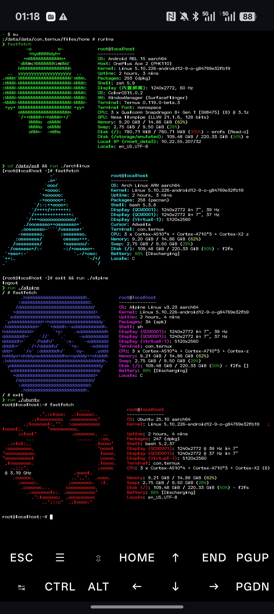

# asl — AndroidSubsystem4GNU/Linux
**Forked from**: 
https://github.com/RuriOSS/asl  
**Special thanks** to RuriOSS for the original project and upstream work. / 特别感谢 RuriOSS 对原始项目及贡献。



简介
----------
ASL（AndroidSubsystem4GNU/Linux）是一个基于 Kam 的 Android 模块，旨在为 Android 设备（Magisk / KernelSU）提供一个轻量、友好的 GNU/Linux 子系统体验。模块以 `rurima` 为统一入口，支持多种发行版模板（例如 Arch、Alpine、CentOS、Debian、Fedora、Kali、Ubuntu），并集成 zsh、Powerlevel10k、zim 等常用 shell 配置。可选地提供 Web 管理界面（ModuleWebUI）用于查看状态、日志和执行常见任务。

主要特性
- 一键进入 Linux 子系统（rurima 入口）
- 多发行版镜像模板（以 release asset 的形式分发）
- shell 体验优化：zsh + Powerlevel10k + zim
- Termux 集成（检测 Termux 并集成其环境）
- 内置管理命令：`rurima pull`、`rurima ota`、`rurima backup`、`rurima unpack`、`rurima dep` 等
- 提供可选 Web UI（ModuleWebUI）用于模块管理与基本操作

安装（Install）
---------------
### 通过 Releases（推荐）
1. 前往 Releases 页面，下载适合你的发行版 `ZIP`（例：`asl-ubuntu-oracular-v1.2.3.zip`）。  
2. 在 Magisk Manager / KernelSU 管理器中选择安装该 zip。  
3. 按提示重启或按安装器提示完成流程。  
4. 打开终端或 Termux，获取 root（`su`），运行 `rurima` 进入 Linux 子系统。

### 构建并安装（开发/测试）
1. 在仓库根目录使用 `kam build` 生成 dist 包（需安装 `kam` CLI 工具）。  
2. 在 `dist/` 中找到构建产物并通过 Magisk / KernelSU 安装。

使用说明（Usage）
-----------------
### 进入环境
```bash
su
rurima
```
进入后默认为 zsh 环境，并加载模块内的 `.rurimarc` / `.zshrc`，若安装了 Powerlevel10k 及 zim，默认可以使用。

### 常用命令（部分）
- `rurima --help` / `rurima -v`：查看帮助 / 版本信息  
- `rurima pull`：拉取镜像或模板  
- `rurima ota`：在线升级/OTA 操作  
- `rurima backup`：备份容器数据  
- `rurima unpack`：解包镜像模板  
- `rurima dep`：安装或配置依赖  
- `rurima r [command]`：在 rurima 环境中直接运行一条命令

### 调试与日志
- 日志目录通常位于模块目录下的 `logs/`（例如 `/data/adb/modules/asl/logs/`）  
- 在报告 issue 时，请附上关键日志内容以便排查

模块文件结构（简要）
-------------------
- `src/asl/`：模块源码目录  
  - `system/xbin/rurima`：模块入口脚本  
  - `.rurima.env`：默认环境变量与 Termux 集成配置  
  - `.rurimarc` / `.zshrc`：shell 初始化与 alias、快捷命令  
  - `customize.sh`：安装钩子、权限设置脚本  
  - `uninstall.sh`：卸载脚本

ModuleWebUI（Web 管理界面）
-------------------------
仓库包含 `ModuleWebUI/`，用于本地管理模块：查看状态、日志与设置等。详见 `ModuleWebUI/docs/` 中的说明，支持启用一些自定义操作按钮和设置界面。

开发与自定义（Customize & Build）
--------------------------------
- 更改/扩展安装逻辑：编辑 `src/asl/customize.sh`  
- 配置模块元信息：编辑 `kam.toml` 与 `src/asl/module.prop`  
- 使用 hooks 扩展构建过程：在 `hooks/` 中添加/修改 pre-/post-build 钩子

使用 kam 构建／How to build with `kam`
-------------------------------------
> 注意：`kam` 是构建工具，请根据 `kam` 的官方文档安装并配置（不同系统安装方法不同）。

1. 设置（可选）构建环境变量（用于覆盖版本、版本代码等）：  
```bash
# 例如设置版本与版本代码
export KAM_MODULE_VERSION="v1.2.3"
export KAM_MODULE_VERSION_CODE=2025120601

# 可选：设置 update.json 指向
export KAM_MODULE_UPDATE_JSON="https://raw.githubusercontent.com/LIghtJUNction/asl/main/update.json"
```

2. 运行构建：
```bash
kam build
```

3. 构建产物将生成在 `dist/` 下，例如：`asl-ubuntu-oracular-v1.2.3.zip`。  
4. 在 CI（如 GitHub Actions）中可通过相同的环境变量自动化构建与发布流程。

常见问题（Troubleshooting）
---------------------------
- 无法进入 rurima：  
  - 确保模块正确安装并启用、终端已获得 `su`；  
  - 检查 `system/bin/rurima` 是否存在且权限为 `700`；  
  - 如使用 Termux，确保 Termux 安装及 PATH 环境正常。

- 运行命令失败 / 权限问题：  
  - 检查 `src/asl/customize.sh` 所设置的 `set_perm` / `set_perm_recursive` 权限；  
 
- 请以root身份执行rurima r xx


反馈与支持（Support）
--------------------
- 报告 issue / 请求功能：请在仓库 Issues 提交（https://github.com/Moe-hacker/asl/issues）  
- 贡献：Fork 仓库 → 新分支 → 建议 PR，并说明改动与理由  
- 联系作者 / 维护者：Moe-hacker, Lin1328, LIghtJUNction

许可与贡献（License & Contributing）
-----------------------------------
- 本仓库 Fork 自：https://github.com/RuriOSS/asl  
- License：MIT（详见 LICENSE 文件）  
- 欢迎各类贡献、报告 bug 与提出功能建议

English Overview
----------------
ASL (AndroidSubsystem4GNU/Linux) is a Kam module for Android that provides a lightweight, user-friendly Linux subsystem environment. It includes support for multiple distro templates and an entrypoint script (`rurima`) to manage and operate the environment. A web UI (ModuleWebUI) is included as an optional management interface.

**Fork & Credits**  
This is a fork of [RuriOSS/asl](https://github.com/RuriOSS/asl). Special thanks to RuriOSS for the original codebase and design.

Quick start:
1. Download release ZIP (e.g., `asl-ubuntu-oracular-v1.2.3.zip`) from Releases.  
2. Install with Magisk Manager / KernelSU manager.  
3. Reboot if needed.  
4. Open terminal, run `su`, then `rurima`.

Build with kam:
```bash
# optional overrides
export KAM_MODULE_VERSION="v1.2.3"
export KAM_MODULE_VERSION_CODE=2025120601
export KAM_MODULE_UPDATE_JSON="https://raw.githubusercontent.com/LIghtJUNction/asl/main/update.json"

kam build
```
The build result appears in `dist/`.

Contributors & License:
- Authors: Moe-hacker, Lin1328, LIghtJUNction  
- License: MIT

Thank you for using ASL — contributions and feedback are welcome!
